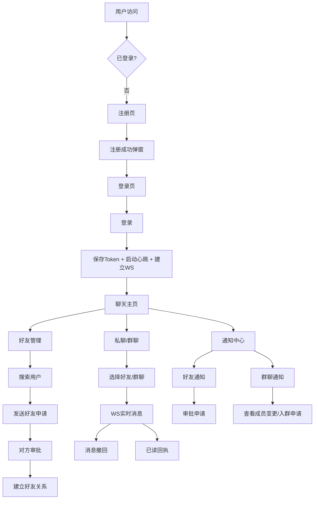
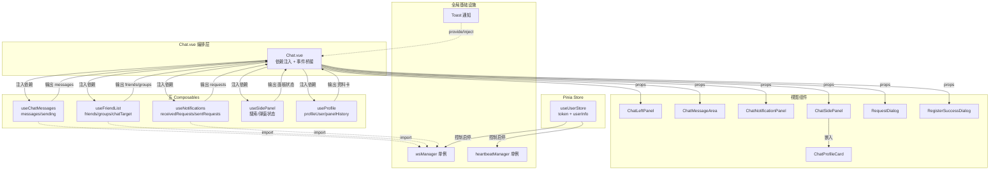
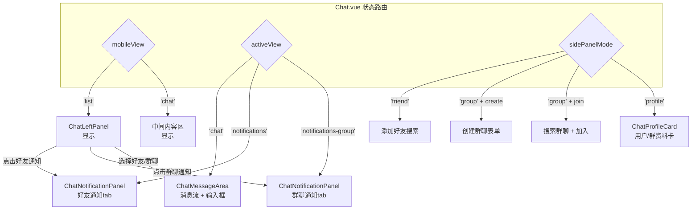

# 实时聊天系统 — 前端系统设计说明书

> Web 课程设计 · 前端部分  
> 技术栈：Vue 3 (Composition API) + Pinia + Element Plus + 原生 WebSocket + Vite 5

---

## 一、系统概述

本系统是一个实时聊天单页应用，前端采用 Vue 3 Composition API 架构，基于 WebSocket 实现毫秒级实时消息推送。前端定位为**纯编排层与视图层**：通过五 Composables 工厂模式管理全部业务状态，严格遵循 props-down/events-up 组件通信，Pinia Store 仅承担认证状态。技术选型理由：原生 WebSocket（零依赖、与 Spring Boot 后端直连）、Vite 5（秒级热更新）、Element Plus（企业级 UI 组件库）。

---

## 二、系统业务流程

系统核心业务流覆盖用户从注册登录到实时聊天的完整链路，包含好友关系管理、群聊协作、通知处理三条主线。

### 2.1 注册登录流程

用户首次访问 → 注册页输入用户名+密码 → 后端生成 8 位数字账号 → 注册成功弹窗展示账号 → 自动填入登录框 → 用户登录 → 后端返回 JWT Token → 前端保存 Token + 用户信息 → 启动心跳（HTTP 2min 间隔）→ 建立 WebSocket 连接 → 跳转聊天主页。

### 2.2 好友管理与私聊流程

加载好友列表（REST + WebSocket 在线状态）→ 侧面板搜索用户 → 发送好友申请（弹窗输入留言）→ 对方收到 WS 实时通知 → 接受/拒绝 → 结果回推 WS → 建立好友关系 → 点击好友进入私聊 → WebSocket 实时收发消息 → 消息撤回（2分钟内）。

### 2.3 群聊与通知流程

创建/加入群聊 → 加载群列表 → 群消息 WebSocket 实时推送 → 群成员变更（加入/退出）WS 通知 → 群主解散/转让 → 入群申请审批 → 邀请入群（被邀请者视角 WS 推送）。

### 2.4 通知中心双入口

左侧栏「好友通知」（好友申请处理）+「群聊通知」（成员变更、入群申请审批、群邀请），分别渲染为 ChatNotificationFriend 和 ChatNotificationGroup 组件，支持 REST 历史加载 + WS 实时增量。

**[图表1：系统核心业务流程图]**



---

## 三、功能模块设计

前端采用**五 Composables + 一 Pinia Store**的模块架构，Chat.vue 作为唯一编排根节点完成模块间依赖注入与通信桥接。

### 3.1 模块职责矩阵

| 模块 | 类型 | 管理状态 | 核心职责 |
|------|------|---------|---------|
| **useUserStore** | Pinia Store | `token`, `userInfo` | 登录/注册/登出、Token 持久化、心跳/WS 生命周期启停 |
| **useFriendList** | Composable | `friends[]`, `groups[]`, `chatTarget`, `activeView` 等 | 好友/群列表加载、在线状态、侧栏展开折叠、群 WS 事件处理、未读数持久化 |
| **useChatMessages** | Composable | `messages[]`, `loading`/`sending` 状态, 分页 | 消息收发（WS 优先/HTTP 降级）、历史加载、乐观更新回滚、消息撤回 |
| **useNotifications** | Composable | `receivedRequests[]`, `sentRequests[]`, `joinGroupRequests[]`, `groupInvites[]` | 好友申请/入群申请/群邀请的全生命周期管理、REST 历史 + WS 增量 |
| **useSidePanel** | Composable | 面板显隐、搜索关键词、搜索结果、防抖实例 | 右侧面板 UI 控制、用户搜索、群搜索、创建群聊、弹窗状态管理 |
| **useProfile** | Composable | `profileUser`, `profileContext`, `panelHistory[]` | 资料卡展示、用户名编辑、密码修改、好友删除、群管理（解散/转让/踢人） |

### 3.2 模块依赖关系

模块间通过 Chat.vue 的依赖注入完成解耦。Composable 之间互不 import，所有依赖通过参数传递：

- **风格A（独立参数）**：`useChatMessages(chatTarget, chatType, friends, messageAreaRef, userStore, toast)` — 简单 ref 依赖，无循环引用
- **风格B（Options 对象 + 回调）**：`useNotifications({ loadFriends, loadGroups, groups, ... })` — 回调解循环依赖（如 useNotifications 需调用 useFriendList 的 `loadFriends`）

**[图表2：功能模块依赖关系图]**



---

## 四、页面 UI 流程设计

系统包含两个页面：Login（登录注册）与 Chat（聊天主页）。通过 Vue Router 守卫实现未认证跳转。

### 4.1 Login 页面 — 拖拽手环双表单切换

Login 页面通过一个**可拖拽的 3D 透视遮罩环**实现登录/注册表单的丝滑切换，而非传统 Tab 切换。

**UI 结构**：背景层（巨型 "chat" 水印） → 前景玻璃卡片（左注册表单 + 右登录表单） → 遮罩环（覆盖一侧表单，露出另一侧）。

**交互流程**：
- maskPosition = 0（遮罩偏左）→ 遮盖注册表单 → 露出登录表单
- maskPosition = 1（遮罩偏右）→ 遮盖登录表单 → 露出注册表单
- 用户拖动圆环 → 实时跟随手指/鼠标 → 松手后弹簧动画吸附最近边缘
- 注册成功后 → `slideTo(0)` 自动滑到登录侧，并将账号填入登录框

**[图表3：Login 页 UI 结构与交互流程]**

```mermaid
flowchart LR
    subgraph "Login 页面布局"
        BG[背景层<br/>chat 水印 768px]
        CARD[玻璃卡片<br/>max-width 1450px]
        LEFT[注册表单区<br/>用户名 + 密码 + 确认密码]
        RIGHT[登录表单区<br/>8位账号 + 密码]
        MASK[可拖拽遮罩环<br/>3D透视椭圆曲线<br/>cubic-bezier弹性动画]
    end
    
    MASK -->|maskPosition=0 遮左| RIGHT
    MASK -->|maskPosition=1 遮右| LEFT
    LEFT -->|注册成功| DIALOG[注册成功弹窗<br/>ElDialog 组件化]
    DIALOG -->|关闭后 slideTo(0)| RIGHT
```

### 4.2 Chat 页面 — 三栏弹性布局 + 通知双入口

Chat 页面是系统的核心操作界面，采用**左-中-右三栏布局**，通过 `activeView` 和 `mobileView` 状态控制视图切换。

**三栏布局**：
- **左侧栏**（ChatLeftPanel）：好友列表 + 群聊列表 + 通知入口（好友通知/群聊通知双入口，折叠面板）。好友按最后消息时间降序 + 在线优先排序。群聊含未读红点（localStorage 持久化）。
- **中间区**：条件渲染。`activeView='chat'` → ChatMessageArea（消息流+输入框）；`activeView='notifications'` → ChatNotificationPanel（好友通知）；`activeView='notifications-group'` → ChatNotificationPanel（群聊通知）。
- **右侧面板**（ChatSidePanel）：`sidePanelMode` 控制三种子视图 — 添加好友搜索、创建/加入群聊、用户/群资料卡。

**移动端自适应**：`mobileView` 状态控制小屏只显示一栏（列表或聊天区），通过「← 返回」按钮切换。

**[图表4：Chat 页面视图状态流转图]**



### 4.3 通知面板双入口设计

左侧栏底部通知区域包含两个独立入口：

- **「好友通知」入口**：显示待处理好友申请数 Badge。点击 → 设置 `notificationTab='friend'`、`activeView='notifications'` → 渲染 ChatNotificationFriend 组件（合并收到的+发出的申请，按时间排序，支持分页加载）。
- **「群聊通知」入口**：显示未读事件数 Badge（成员变更 + 入群申请 + 群邀请的未读合计）。点击 → 设置 `notificationTab='group'`、`activeView='notifications-group'` → 渲染 ChatNotificationGroup 组件（气泡流展示三种事件类型）。

---

## 五、核心设计亮点分析

### 亮点一：Login 页 3D 透视遮罩环拖拽交互

**设计思路**：传统登录/注册切换通常使用 Tab 栏，视觉单调。本方案通过一个覆盖在表单上方的渐变遮罩环，利用 CSS 3D 椭圆曲线 + 实时拖拽 + 弹性动画实现「手环环绕」的视觉效果，同时作为表单切换的唯一控制件。

**代码实现**：

`useDragMask` Composable（`src/composables/useDragMask.js`）封装了全部拖拽逻辑：

```javascript
// 拖拽中实时计算 position（0~1），方向跟踪
const maskPosition = ref(0);
const dragDirection = ref(null);  // 'left' | 'right' | null

function onMove(clientX) {
  const deltaX = clientX - startX.value;
  maskPosition.value = Math.max(0, Math.min(1, 
    startPosition.value + deltaX / maskWidth.value
  ));
  dragDirection.value = deltaX > 0 ? 'right' : deltaX < 0 ? 'left' : dragDirection.value;
}

// 松手后弹性吸附：超过中点 > 0.5 → snap to 1，否则 → snap to 0
function endDrag() {
  isDragging.value = false;
  const threshold = (containerWidth.value / 2 - maskWidth.value / 2) / maskWidth.value;
  maskPosition.value = maskPosition.value > threshold ? 1 : 0;
}
```

核心技术难点在于**CSS 3D 椭圆曲线的遮罩裁剪**。左侧椭圆弧通过 `mask: radial-gradient(ellipse 50px 50% at left center, transparent 0 99%, black 100%)` 在绿色渐变带上「挖出」透明椭圆孔，形成环绕的 3D 错觉。独立剥离的 `ring-left-curve-down` 元素与遮罩同步 `translateX`，补全下层椭圆阴影。

**效果**：用户在 Desktop（mousedown/mousemove/mouseup）和 Mobile（touchstart/touchmove/touchend）均获得 60fps 顺滑拖拽体验，松手后以 `cubic-bezier(0.68, -0.55, 0.27, 1.55)` 回弹曲线吸附至最近边缘。拖拽期间 CSS transition 动态设为 `none` 消除动画滞后。

---

### 亮点二：Chat.vue 五 Composables 编排模式 + 依赖注入

**设计思路**：传统 Vue 项目容易将业务逻辑堆积在组件内或全部塞入 Vuex/Pinia，导致巨型文件、难以测试、复用性差。本方案将聊天系统的全部业务逻辑拆分为 5 个职能明确的 Composable，Chat.vue 仅作为「依赖注入 + 事件桥接」的编排根节点，自身不持有业务状态。

**代码实现**：

Chat.vue 的核心代码是依赖链的构建（`src/views/Chat.vue:187-249`）：

```javascript
// 第1步：实例化 useFriendList（最底层，无外部依赖）
const { friends, groups, chatTarget, chatType, mobileView, activeView,
        loadFriends, loadGroups, ... } = useFriendList(toast);

// 第2步：实例化 useChatMessages（依赖 chatTarget, chatType, friends）
const { messages, resetChat, loadChatHistory, onSendMessage, recallMessage, ... }
  = useChatMessages(chatTarget, chatType, friends, messageAreaRef, userStore, toast);

// 第3步：实例化 useNotifications（通过回调解循环依赖）
const { receivedRequests, sentRequests, joinGroupRequests, groupInvites, ... }
  = useNotifications({ loadFriends, loadGroups, groups, activeView, chatTarget, ... });

// 第4步：实例化 useSidePanel + useProfile（组装多个 composable 的输出）
const { showSidePanel, sidePanelMode, handleAddFriend, ... }
  = useSidePanel({ toast, sentRequests, loadGroups, ... });
const { profileUser, profileContext, handleDeleteFriend, ... }
  = useProfile({ toast, friends, groups, chatTarget, resetChat, closeSidePanel, ... });
```

其中解决**循环依赖**的关键技术是回调注入：`useNotifications` 需要调用 `useFriendList` 的 `loadFriends()`，但 `useFriendList` 先于 `useNotifications` 初始化。通过将 `loadFriends` 作为回调函数传入 `useNotifications` 的 options 对象，延迟绑定时序，打破实例化顺序的约束。

**效果**：Chat.vue 仅 ~470 行 script，核心是依赖图构建。每个 Composable 可独立理解和修改（如只改消息逻辑只需动 `useChatMessages.js`，不影响好友列表）。Composable 之间的数据流完全显式化，调试时可以直接在 Chat.vue 的 `console.log(friends.value)` 观察任意中间状态。

---

### 亮点三：WebSocket 实时通信架构 — 单例 + 双 Handler + 乐观更新

**设计思路**：实时聊天对消息延迟和可靠性要求极高。本方案采用 WebSocket 优先策略：消息发送优先走 WS 长连接（零 HTTP 握手开销），仅在 WS 断开时降级 HTTP。消息到达后通过「双 Handler 模式」同时更新消息展示区和侧边栏状态。消息撤回采用「乐观更新 + API 回滚」确保 UI 即时响应用户操作。

**代码实现**：

**① WS 单例管理器**（`src/utils/websocket.js`）— 基于 EventBus 模式：

```javascript
// 连接时自动推导 ws:// 或 wss:// 协议（生产环境 Nginx 反向代理自动适配）
connect() {
  const wsEnvUrl = import.meta.env.VITE_WS_URL || '/ws/chat';
  if (!wsEnvUrl.startsWith('ws://') && !wsEnvUrl.startsWith('wss://')) {
    const protocol = window.location.protocol === 'https:' ? 'wss:' : 'ws:';
    wsUrl = `${protocol}//${window.location.host}${wsEnvUrl}?token=${token}`;
  }
  // 认证失败（code 4001/1008）→ 停止重连，防止无限重试
}
```

**② 双 Handler 模式**（`src/composables/useChatMessages.js:236-275`）— PRIVATE_MESSAGE 同时被两个 Composable 独立处理：

- **useChatMessages Handler**：负责消息展示。自己发送的消息回传 → 按 `_id` 匹配替换临时消息为真实的 `recordId`；他人消息 → 追加到列表 + 滚动到底部。当前聊天窗口的消息自动发送 `READ_RECEIPT`。
- **useFriendList Handler**：负责侧边栏状态。更新 `lastMessage`/`lastMessageTime`（用于排序）、清除或累加 `unreadCount`。两者各自独立操作 `friends[]` 数组，以双重覆盖保证未读计数一致性。

**③ 乐观更新 + 回滚**（`src/composables/useChatMessages.js:124-176`）：

```javascript
// 1. 创建临时消息（_id 为 client 时间戳，不是后端 recordId）
const tempMsg = { _id: Date.now(), senderId, content, sendTime, ... };
messages.value.push(tempMsg);           // 立即显示
messageAreaRef.value?.scrollToBottom(); // 立即滚到底部

// 2. WS 优先发送
const sent = wsManager.send({ type: 'PRIVATE_MESSAGE', receiverId, content });
if (!sent) {
  await sendMessageApi({ receiverId, content });  // HTTP 降级
}

// 3. 失败回滚
catch (e) {
  toast.error('消息发送失败，请重试');
  messages.value = messages.value.filter(m => m._id !== tempMsg._id); // 移除临时消息
}
```

**④ 消息撤回时间窗口**（`src/components/chat/ChatMessageArea.vue:188-195`）：只有自己发送的、2 分钟内的、未被撤回的、有 `recordId` 的消息才可撤回，右键菜单仅在满足条件时弹出。

**效果**：用户在良好网络下消息几乎即时送达（WS 延迟 < 50ms），断网自动降级 HTTP 保证不丢消息。撤回操作乐观标记 `recalled=true`，即使 API 调用慢于预期，UI 也立即反映撤回状态。

---

### 亮点四：组件化弹窗 + 绿色主题磨砂玻璃设计系统

**设计思路**：传统 Element Plus 中使用 `ElMessageBox` 展示富内容弹窗需要 `dangerouslyUseHTMLString: true`，将 HTML 拼接在 JS 字符串中，导致：① XSS 风险（用户输入的昵称/群名可能注入脚本）；② CSS 必须写在 unscoped 块中；③ 代码可维护性差（无法使用 Vue 模板语法）。本方案将所有卡片弹窗重构为独立的 `ElDialog` Vue 组件，配合统一的磨砂玻璃设计系统，彻底消除 `dangerouslyUseHTMLString`。

**代码实现**：

**① 设计令牌集中管理**（`src/assets/shared.css:10-40`）：

```css
:root {
  --primary-gradient: linear-gradient(135deg, #11998e 0%, #38ef7d 100%);
  --primary-color: #11998e;
  --accent-color: #62d2a2;
  --glass-bg: rgba(255, 255, 255, 0.25);
  --glass-blur: blur(20px);
  --radius-card: 16px;
  --radius-control: 8px;
  --ease-bounce: cubic-bezier(0.68, -0.55, 0.27, 1.55);
  --transition-fast: 0.3s ease;
  --shadow-card: 0 8px 32px rgba(0,0,0,0.1), 0 2px 8px rgba(0,0,0,0.05);
}
```

全局 class 体系包括 `.glass-card`（磨砂玻璃卡片）、`.btn-accept`（绿色确认按钮）、`.btn-danger`（红色危险按钮）、`.form-input`（表单输入框）等，确保整个项目视觉统一。

**② 弹窗组件化**：以 `RegisterSuccessDialog`（`src/components/common/RegisterSuccessDialog.vue`）为例，将原来写在 JS 字符串中的完整 HTML 卡片转为 Vue 模板：

```html
<el-dialog v-model="visible" title="注册成功" class="register-success-dialog">
  <div class="register-success-card">
    <div class="register-success-icon"><!-- SVG 绿色勾 --></div>
    <div class="register-success-title">注册成功</div>
    <div class="register-success-info">
      <div class="register-success-row">
        <span class="register-success-label">账号</span>
        <span class="register-success-value account-value">{{ userAccount }}</span>
      </div>
      <div class="register-success-row">
        <span class="register-success-label">用户名</span>
        <span class="register-success-value">{{ userName }}</span>
      </div>
    </div>
  </div>
  <template #footer>
    <el-button type="primary" @click="visible = false">我知道了，去登录</el-button>
  </template>
</el-dialog>
```

`RequestDialog`（`src/components/chat/RequestDialog.vue`）进一步复用于好友申请和加群申请两种场景，通过 `mode` prop 切换标题、placeholder、默认留言，避免重复代码。

**③ 绿色主题磨砂玻璃**：弹窗外框使用低透明度绿色渐变：

```css
.el-dialog.register-success-dialog {
  background: linear-gradient(135deg, rgba(17,153,142,0.15), rgba(56,239,125,0.10)) !important;
  backdrop-filter: blur(24px);
  -webkit-backdrop-filter: blur(24px);  /* Safari 兼容 */
  border: 1px solid rgba(56,239,125,0.3) !important;
}
```

同时通过 `.el-overlay:has(.register-success-dialog)` 将遮罩层从默认的 50% 黑色降低至 8%，让磨砂玻璃的模糊透视效果得以显现。

**效果**：弹窗外观呈现淡绿色半透明磨砂玻璃质感，边框和内卡均带有绿色调，与项目的 `#11998e → #38ef7d` 主渐变主题统一。组件的 scoped 样式不再依赖 `!important` 对抗全局 CSS，`dangerouslyUseHTMLString` 完全归零，从根本上杜绝了 XSS 注入风险。

---

## 设计亮点总结

| 亮点 | 关键技术 | 解决的问题 |
|------|---------|-----------|
| 3D 透视遮罩环 | Composable + CSS mask 裁剪 + 弹性动画 | 登录/注册切换从单调 Tab 升维为沉浸式物理交互 |
| 五 Composable 编排 | 依赖注入 + 回调解循环依赖 + Chat.vue 纯编排 | 巨型组件拆分、模块可测试、依赖关系显式化 |
| WS 实时通信 | 单例 + 双 Handler + 乐观更新 + 撤回时间窗口 | 毫秒级消息推送、断网降级、撤回零延迟 |
| 组件化弹窗 + 设计系统 | ElDialog + CSS 变量 + 磨砂玻璃 + unscoped/scoped 分层 | 消灭 `dangerouslyUseHTMLString`、视觉统一、XSS 归零 |
